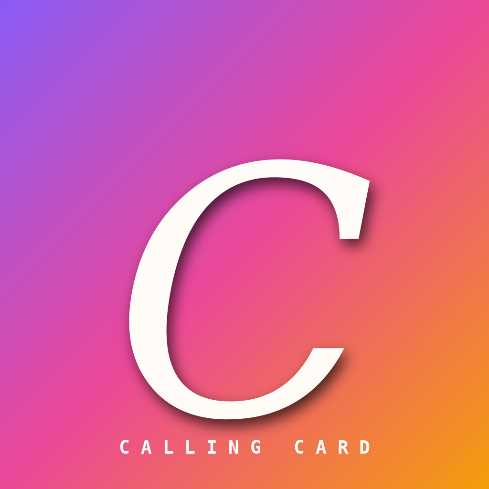

# Control Deck — iOS

The Calling Card admin app. Native SwiftUI for iPhone and iPad.

> Manage every model's calling-card profile from your phone — drag-reorder
> modules, switch themes, generate copy, hit Publish.



---

## What's in this folder

```
shelly-ios/
├── README.md                          ← you are here
├── project.yml                        ← XcodeGen — generates the .xcodeproj
├── .github/workflows/build-ipa.yml    ← Cloud build → unsigned IPA artifact
└── ControlDeck/
    ├── ControlDeckApp.swift           @main entry point
    ├── Info.plist
    ├── Assets.xcassets/               App icon + accent color
    ├── Models/
    │   ├── AppStore.swift             Single source of truth (@Observable)
    │   ├── ModelProfile.swift         The per-model profile data
    │   ├── ProfileModule.swift        The 10 modules
    │   ├── ThemePreset.swift          The 10 themes
    │   └── AIService.swift            Mock generator (swap with Anthropic API)
    ├── Views/
    │   ├── RootView.swift             3-column NavigationSplitView
    │   ├── RosterSidebar.swift        Roster + Library
    │   ├── ModuleListView.swift       Drag-reorder + visibility toggles
    │   ├── EditorView.swift           Per-module form + AI inline result
    │   ├── ThemeGrid.swift            10 theme chips
    │   ├── AIPanelSheet.swift         Bottom sheet with the 5 AI tasks
    │   ├── PreviewWebView.swift       WKWebView showing the live profile
    │   ├── PublishBar.swift           Sticky save state + Publish button
    │   └── SettingsSheet.swift        Appearance + API key
    ├── Theme/
    │   └── ColorExtensions.swift      Hex colors + brand tokens
    └── Resources/
        └── profile-demo.html          Bundled — what the WKWebView preview loads
```

`profile-demo.html` is the same file that ships on the public web side, so
the in-app preview is byte-for-byte identical to production.

---

## How to get this onto your iPhone

You're on Windows, so you don't have Xcode. There are three realistic paths.
The first is the one I'd actually use.

### Path A — Cloud build, AppDB install (recommended)

1. **Push this folder to a private GitHub repo.**
   Either drag the folder onto github.com/new, or use GitHub Desktop.
2. **GitHub Actions auto-runs.** Open the **Actions** tab → wait ~5 minutes
   for the green check. The workflow file is `.github/workflows/build-ipa.yml`.
3. **Download the artifact.** On the workflow run page, scroll to **Artifacts**,
   click `ControlDeck-unsigned-ipa` to download a zip. Inside is `ControlDeck-unsigned.ipa`.
4. **Upload to AppDB.** Open AppDB Pro on your iPhone → **My Apps** → **Upload IPA**
   → pick the file → it signs with your AppDB cert and installs.
5. **Done.** Tap the new "Control Deck" icon on your home screen.

When you change the code (rename a button, add a feature), push to GitHub
and a new IPA pops out a few minutes later. Re-upload to AppDB. Done.

### Path B — Cloud Mac (one-off rental, you keep the build)

If you want to learn the Xcode side without owning a Mac:

1. Sign up for **MacInCloud** or **Codemagic** — both offer per-hour Mac rentals.
2. Open Terminal: `brew install xcodegen`, then `cd` into this folder, then `xcodegen`.
3. Open `ControlDeck.xcodeproj` in Xcode → **Product → Archive** → **Distribute → Ad Hoc** → Export.
4. Same flow as Path A from there: upload the .ipa to AppDB Pro.

### Path C — Get a Mac

Path A is so cheap and easy that this only makes sense if you start shipping
many iOS projects. A used Mac mini will pay itself off in a month of cloud
runner usage if you're iterating fast.

---

## How AppDB sees this IPA

The IPA produced by the Actions workflow is **unsigned** by design — meaning
no embedded provisioning profile, no developer certificate. AppDB Pro
re-signs it with your account-tied certificate at install time. This works
because:

- **Bundle ID** is `app.callingcard.controldeck` — change it in `project.yml`
  if AppDB complains about a collision with another app.
- **Capabilities** are minimal — just standard UIKit/SwiftUI. No push
  notifications, no Sign in with Apple, no entitlements that require a
  provisioning profile.
- **iOS 17.0+** target. AppDB has full support; this just means iPhone XS
  or newer.

If AppDB rejects the IPA with "missing entitlements", open `project.yml`
and add what's needed under `settings.base`. The default config is
deliberately bare so signing succeeds first try.

---

## What the app does, screen-by-screen

| Column / Screen        | Notes                                                                                      |
| ---------------------- | ------------------------------------------------------------------------------------------ |
| **Roster sidebar**     | All your models. Status dots: green = published, amber = draft, gray = unpublished.        |
| **Module list**        | Long-press any row to drag-reorder. Eye icon toggles visibility. Tap to select for edit.   |
| **Editor**             | Form fields specific to the selected module. Every field has a `✦ Generate` shortcut.      |
| **Theme grid**         | Tap any chip to instantly re-skin the model. Live preview updates via WKWebView JS.        |
| **AI Panel**           | Bottom sheet. 5 tasks. Tap → loading → Accept/Re-roll/Edit. Mock locally; can hit Claude.  |
| **Live Preview**       | Toolbar `safari` icon. WKWebView loads bundled HTML, inject theme via JS.                  |
| **Publish bar**        | Bottom strip. Pulse dot while saving. Publish button shows a confirmation toast.           |
| **Settings**           | Appearance picker + Anthropic API key field (used only if you wire up real generation).    |

---

## Wiring up real AI generation

Right now `AIService.generate(_:for:)` returns canned drafts so the app
works offline. To plug in actual Claude:

1. Get an Anthropic API key — paste it in **Settings → Anthropic API key**.
2. In `Models/AIService.swift`, replace the body of `generate(_:for:)` with
   a `URLSession` call to `https://api.anthropic.com/v1/messages`.
3. The system prompt is in `ARCHITECTURE.md` §10 from the web project.
   Copy it verbatim — it's already SFW-guardrailed.
4. Parse `response.content[0].text` into an `AIResult`.

A starter implementation:

```swift
import Foundation

@MainActor
final class AIService {
    static let shared = AIService()

    func generate(_ task: AITask, for model: ModelProfile) async -> AIResult {
        let key = UserDefaults.standard.string(forKey: "anthropicAPIKey") ?? ""
        guard !key.isEmpty else {
            return AIResult(task: task, text: "[Add your API key in Settings]")
        }
        // … build URLRequest with x-api-key, anthropic-version, model, system, messages …
        // … decode response …
        return AIResult(task: task, text: parsedText)
    }
}
```

The mock implementation lives in this repo as a fallback for offline use
and App Store review.

---

## Local Mac quickstart (for reference)

If you ever sit down at a Mac:

```bash
brew install xcodegen
cd shelly-ios
xcodegen
open ControlDeck.xcodeproj
```

Hit ⌘R to run on a simulator. Hit ⌘B then look in `~/Library/Developer/Xcode/DerivedData/`
for the `.app`. Wrap into IPA:

```bash
mkdir Payload && cp -R path/to/ControlDeck.app Payload/
zip -r ControlDeck.ipa Payload
```

---

## Roadmap

- **v1** (this one) — full module editor, theme grid, mock AI, WKWebView preview, local JSON persist.
- **v1.1** — real Anthropic API in `AIService`. Live import of `themes.json` from a URL so themes stay in sync with the web.
- **v1.2** — Photos picker for the Gallery module. Multi-select drag.
- **v2**   — Supabase backend so the iOS app and the web admin share state.
            Apple Sign-In + multi-user roster.
- **v2.1** — iPad-only Pencil annotation on preview ("circle this caption, fix that color").

---

## Troubleshooting

**Actions build fails with `xcodebuild: error: Could not resolve scheme`** —
re-run XcodeGen locally and commit the regenerated `.xcodeproj`, or check
that `project.yml` parses cleanly (`xcodegen generate --quiet` should print nothing).

**AppDB says "missing entitlements"** — usually means the bundle ID is taken.
Edit `PRODUCT_BUNDLE_IDENTIFIER` in `project.yml` to something unique like
`app.callingcard.controldeck.major`, push, re-build.

**Preview is blank** — `profile-demo.html` may not have made it into the
bundle. In Xcode: select the file, check **Target Membership → ControlDeck**.
If you regenerated the project with XcodeGen, this is automatic.

**Drag-reorder doesn't work on iPhone** — long-press for ~0.4s before dragging.
Edit mode is forced on (`environment(\.editMode, .constant(.active))`) so
the drag handles are always visible.
